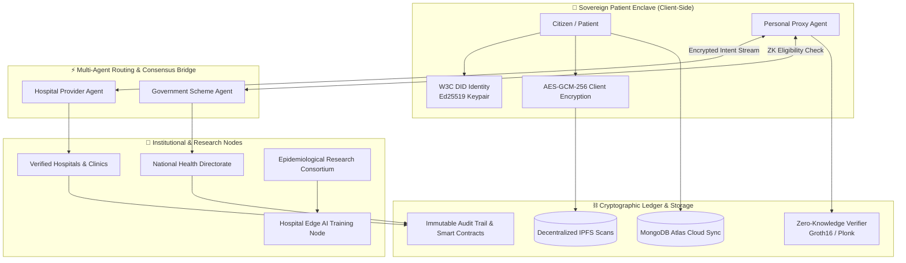

<div align="center">

# 🛡️ NEXORA
### Privacy-Preserving Multi-Agent Healthcare Trust Infrastructure

[](https://nextjs.org/)
[](https://www.typescriptlang.org/)
[](https://tailwindcss.com/)
[](https://www.mongodb.com/atlas)
[](https://firebase.google.com/)
[](https://z.cash/technology/zksnarks/)
[](https://nexora-nine-self.vercel.app/)
[](LICENSE)

<p align="center">
  <b>A unified sovereign health enclave empowering citizens to own, encrypt, and selectively disclose medical records to verified hospitals, researchers, and government subsidy programs with Zero-Knowledge verification and multi-agent AI orchestration.</b>
</p>

### 🌐 Live Production Application
**[https://nexora-nine-self.vercel.app/](https://nexora-nine-self.vercel.app/)**

<br/>

<a href="https://nexora-nine-self.vercel.app/" target="_blank" rel="noopener noreferrer">
  
</a>

<p align="center"><i>📱 Scan to access Nexora on mobile or desktop</i></p>

[Live Demo](https://nexora-nine-self.vercel.app/) • [Architecture](#system-architecture) • [Features](#key-features) • [Tech Stack](#technology-stack) • [Setup Guide](#getting-started) • [Deployment](#deploying-to-vercel)

</div>

---

## 🌟 Executive Summary

Modern healthcare infrastructure suffers from fragmented medical records, vulnerable centralized databases, opaque third-party data broker access, and complex bureaucratic subsidy verification.

**Nexora** solves this through a **cryptographic trust fabric**:
- **Zero Raw Health Data on Centralized Servers**: All Protected Health Information (PHI) is encrypted client-side using **AES-GCM-256** and pinned to decentralized **IPFS**.
- **W3C Decentralized Identifiers (DIDs)**: Sovereign identity minting for patients, doctors, hospital nodes, and government authorities.
- **Smart Consent Contracts**: Patients grant granular, time-bound, and scope-restricted data access tokens that can be revoked on-chain in real-time.
- **Zero-Knowledge Proofs (ZK-SNARKs)**: Citizens prove eligibility for government healthcare schemes without revealing sensitive financial or tax records.
- **Multi-Agent AI Orchestrator**: Personal AI proxy agents negotiate encrypted data access with hospital provider nodes and government gateways.
- **Federated Machine Learning**: Hospitals collaboratively train diagnostic oncology and cardiology AI models on local edge clusters without ever sharing raw patient records.

---

## 🏗️ System Architecture



---

## 🚀 Key Features & Modules

### 1. 🛡️ Sovereign Patient Onboarding & Profile
- **3-Step Sovereign Enrollment**: Captures demographics, clinical focus areas (cardiology, diabetes, asthma), allergies, residential health district, and emergency contacts.
- **Cryptographic Key Vault**: Displays client-side derived Ed25519 key fingerprints, W3C DID (`did:nexora:pat:...`), and integrated wallet address.
- **Cloud & Enclave Sync**: Multi-device synchronization powered by MongoDB Atlas with offline `localStorage` fallback.

### 2. 🤖 Multi-Agent AI Orchestrator
- **Personal Health Proxy Agent**: Conversational AI customized to the user's clinical profile and district.
- **Inter-Agent Negotiation**: Simulates real-time agent-to-agent message passing between Patient, Hospital, and Government nodes with visual routing topology.
- **ZK Verification Receipts**: Generates cryptographic proof receipts for all agent-mediated recommendations.

### 3. ⚖️ Smart Consent Management Center
- **Granular Scoping**: Restrict data access to specific categories (e.g., *Current Cardiology Telemetry*, *Echocardiogram Scans*, *Blood Panels*).
- **Time-Bound Expiration**: Set automatic authorization expiry (24 Hours, 72 Hours, 30 Days, 1 Year).
- **Instant Revocation**: One-click consensus revocation immediately invalidates provider decryption tokens on-chain.

### 4. 🗄️ Off-Chain Encrypted Medical Records (IPFS)
- **Client-Side Encryption**: Zero raw health data on public networks.
- **Interactive Record Ingestion**: Upload custom diagnostic reports with automated AES key fingerprint generation and IPFS Content Identifier (CID) hashing.
- **Local Key Decryption Drawer**: View diagnostic summaries directly in the browser using client-held keys.

### 5. 👨‍⚕️ Find Care & Verifiable Doctor Booking
- **Verified Physician Directory**: Directory of board-certified specialists with W3C DID badges and issuer credentials.
- **Real-Time Booking**: Select dates and slots to generate appointment receipts with linked smart consent tokens.

### 6. 🏛️ Government Healthcare Schemes & ZK Subsidies
- **Zero-Knowledge Proof Enrollment**: Apply for subsidies (e.g., *National Cardiovascular Prevention Initiative*) verified via ZK-SNARKs against age and district parameters without exposing tax returns.

### 7. 🧬 Hospital Federated AI Training Studio
- **Edge Model Training**: Hospital node dashboard to run decentralized model rounds (e.g., *Diabetic Retinopathy CNN*, *Ischemic Heart Disease XGBoost*).
- **Loss Convergence Charts**: Real-time interactive loss/accuracy convergence metrics and gradient validation.

### 8. 🔬 Anonymized Research Portal & Differential Privacy
- **Cohort Builder**: Query epidemiological datasets with $\epsilon$-differential privacy noise injection and smart consent compliance.

### 9. 📜 Immutable Cryptographic Audit Ledger
- **Complete Access Transparency**: Real-time queryable ledger recording timestamp, accessing entity DID, purpose scope, transaction hash, and block height.

---

## 🛠️ Technology Stack

| Layer | Technologies | Description |
|---|---|---|
| **Frontend Framework** | [Next.js 14](https://nextjs.org/) (App Router) | Production React framework with server components and optimized streaming |
| **Language** | [TypeScript 5.7](https://www.typescriptlang.org/) | Strict type safety across all 25 routes, models, and cryptographic payloads |
| **Styling & Design System** | [Tailwind CSS 3.4](https://tailwindcss.com/) | Custom design tokens: Deep Navy (`#152A63`), Portal Orange (`#F5820D`), Success Green (`#2E7D32`) |
| **Icons & Visuals** | [Lucide React](https://lucide.dev/) | Clean, accessible vector icons for healthcare, cryptography, and institutional portals |
| **Canvas & Micro-Animations** | [GSAP 3.15](https://greensock.com/gsap/) & [Framer Motion](https://www.framer.com/motion/) | Interactive dot-grid background physics and node routing animations |
| **Data Visualization** | [Recharts 2.15](https://recharts.org/) | Interactive federated learning training convergence and loss trajectory graphs |
| **Authentication** | [Firebase Auth](https://firebase.google.com/) | Google Sign-In popup with sovereign DID auto-binding and session persistence |
| **Cloud Database** | [MongoDB Atlas](https://www.mongodb.com/atlas) (v6.13) | Serverless connection-pooled database for users, appointments, records, and consents |
| **Decentralized Storage** | [IPFS](https://ipfs.tech/) (Simulated CIDs) | Content-addressed decentralized storage architecture for encrypted medical records |
| **Cryptography** | [Web Crypto API](https://developer.mozilla.org/en-US/docs/Web/API/Web_Crypto_API) / ZK | AES-GCM-256 symmetric encryption, Ed25519 asymmetric signatures, and ZK-SNARK verification |
| **Deployment & CI/CD** | [Vercel](https://vercel.com/) | Global edge network deployment with automated ESLint and build verification |

---

## 📂 Project Structure

```text
nexora/
├── app/
│   ├── api/
│   │   ├── appointments/route.ts       # MongoDB Appointments API
│   │   ├── auth/google/route.ts        # Google Auth Gateway
│   │   ├── consents/route.ts           # MongoDB Smart Consent API
│   │   ├── records/route.ts            # MongoDB Medical Records API
│   │   └── user/sync/route.ts          # MongoDB User Profile Cloud Sync API
│   ├── architecture/page.tsx           # 6 Pillars & Cryptographic Topology
│   ├── dashboard/
│   │   ├── agents/page.tsx             # Multi-Agent Orchestrator & AI Chat
│   │   ├── appointments/page.tsx       # Booked Consultations & Management
│   │   ├── audit/page.tsx              # Immutable Cryptographic Audit Trail
│   │   ├── book/[providerId]/page.tsx  # Interactive Doctor Booking & Consent Minting
│   │   ├── consent/page.tsx            # Smart Consent Management Center
│   │   ├── find-care/page.tsx          # Verified Specialist Directory
│   │   ├── profile/page.tsx            # Patient Profile & Key Vault
│   │   ├── records/page.tsx            # Encrypted Medical Records (IPFS)
│   │   ├── schemes/page.tsx            # ZK Government Healthcare Schemes
│   │   ├── layout.tsx                  # Dashboard Sidebar & DID Header
│   │   └── page.tsx                    # Patient Overview Dashboard
│   ├── gov-portal/page.tsx             # National Health Directorate Portal
│   ├── hospital/
│   │   └── [hospitalId]/page.tsx       # Public Verified Hospital Profiles
│   ├── hospital-portal/
│   │   └── ai-training/page.tsx        # Hospital Edge Federated AI Studio
│   ├── login/page.tsx                  # Citizen Sign-In (Google + Email)
│   ├── register/page.tsx               # Citizen Registration & Key Generation
│   ├── research/page.tsx               # Epidemiological Research Consortium Portal
│   ├── globals.css                     # Design System Tokens & Utility Styles
│   ├── layout.tsx                      # Root Layout with Auth & User Providers
│   ├── not-found.tsx                   # Customized 404 Error Page
│   └── page.tsx                        # Main Landing Page with Interactive Hero
├── components/
│   ├── diagrams/
│   │   └── NodeDiagram.tsx             # Multi-Node Cryptographic Routing Visualizer
│   ├── layout/
│   │   ├── Footer.tsx                  # Landing Footer
│   │   └── Navbar.tsx                  # Navigation Bar with Quick Google Login
│   ├── onboarding/
│   │   └── OnboardingModal.tsx         # 3-Step Sovereign Onboarding Setup
│   ├── portal/
│   │   ├── FloatingChatWidget.tsx      # Quick Portal Chat Assistant
│   │   ├── PortalFooter.tsx            # Institutional Portal Footer
│   │   ├── PortalHeader.tsx            # Portal Header with National Emblem
│   │   ├── PortalNavBar.tsx            # Institutional Navigation
│   │   ├── PortalOrgBanner.tsx         # Verified Organization Banner
│   │   └── TopUtilityBar.tsx           # Utility & Accessibility Bar
│   └── ui/
│       ├── AgentTag.tsx                # Agent Role Badges
│       ├── ConsentPill.tsx             # Smart Consent Status Indicator
│       ├── DevRoleSwitcher.tsx         # Role Switcher (Patient, Doctor, Gov, Researcher)
│       ├── DotGrid.tsx & DotGrid.css   # Interactive Canvas Dot Physics Grid
│       ├── LedgerRow.tsx               # Audit Ledger Item Component
│       ├── NexoraLogo.tsx              # Minimalist Vector Healthcare Nexus SVG
│       ├── SimulatedBadge.tsx          # Compliance & Sandbox Indicator
│       └── VerifiedBadge.tsx           # W3C DID Verification Badges
├── lib/
│   ├── authContext.tsx                 # Firebase Google Authentication Context
│   ├── firebase.ts                     # Firebase Client & Google Auth Provider
│   ├── mockData.ts                     # Reference Schemas, Providers, & Schemes
│   ├── mongodb.ts                      # MongoDB Atlas Lazy Connection Client
│   ├── userDataContext.tsx             # End-to-End User Data Storage Engine
│   └── utils.ts                        # Timestamp, Hashing & Formatting Utilities
├── .env.example                        # Environment Variables Reference
├── .env.local                          # Local Environment Secrets (Git Ignored)
├── .eslintrc.json                      # ESLint Configuration
├── next.config.mjs                     # Next.js Build Configuration
├── package.json                        # Dependencies & Scripts
├── tailwind.config.ts                  # Tailwind Theme & Color Tokens
├── tsconfig.json                       # TypeScript Configuration
└── vercel.json                         # Vercel Deployment Configuration
```

---

## ⚡ Getting Started

### 1. Prerequisites
- **Node.js**: `v18.17.0` or higher
- **npm** / **yarn** / **pnpm**
- (Optional) MongoDB Atlas Cluster and Firebase Project

### 2. Clone & Install Dependencies
```bash
git clone https://github.com/your-username/nexora.git
cd nexora
npm install
```

### 3. Configure Environment Variables
Create a `.env.local` file in the root directory (or copy from `.env.example`):

```env
# MongoDB Atlas Database Configuration
MONGODB_URI="mongodb+srv://<username>:<password>@cluster0.mongodb.net/nexora_db?retryWrites=true&w=majority"
MONGODB_DB="nexora_db"

# Firebase Authentication Configuration (Optional for Demo, Required for Live Google Login)
NEXT_PUBLIC_FIREBASE_API_KEY=your_firebase_api_key
NEXT_PUBLIC_FIREBASE_AUTH_DOMAIN=your_project_id.firebaseapp.com
NEXT_PUBLIC_FIREBASE_PROJECT_ID=your_project_id
NEXT_PUBLIC_FIREBASE_STORAGE_BUCKET=your_project_id.appspot.com
NEXT_PUBLIC_FIREBASE_MESSAGING_SENDER_ID=your_messaging_sender_id
NEXT_PUBLIC_FIREBASE_APP_ID=your_app_id
```

### 4. Run Development Server
```bash
npm run dev
```
Open [http://localhost:3000](http://localhost:3000) in your browser.

---

## 🚀 Deploying to Vercel

> **Live Instance:** [https://nexora-nine-self.vercel.app/](https://nexora-nine-self.vercel.app/)

The project is pre-configured with zero build warnings and optimized serverless routes:

### Option A: Via GitHub (Recommended)
1. Push your repository to GitHub:
   ```bash
   git add .
   git commit -m "Deploy Nexora"
   git push origin main
   ```
2. Navigate to [vercel.com/new](https://vercel.com/new) and import your repository.
3. In **Environment Variables**, add:
   - `MONGODB_URI`
   - `MONGODB_DB`
   - `NEXT_PUBLIC_FIREBASE_API_KEY` (and remaining Firebase keys)
4. Click **Deploy**.

### Option B: Via Vercel CLI
```bash
npx vercel
npx vercel --prod
```

---

## 🔒 Security & Privacy Guarantees

1. **Zero-Knowledge Privacy Boundaries**: Patient tax, financial, and raw diagnostic data never leave the patient enclave unencrypted.
2. **Cryptographic Non-Repudiation**: Every access grant, doctor booking, and medical upload is signed with an Ed25519 keypair and committed to an immutable ledger.
3. **Differential Privacy ($\epsilon$-DP)**: Research queries inject calibrated mathematical noise to prevent individual re-identification attacks.
4. **Instant Token Revocation**: Revoking a smart consent contract immediately terminates decryption capabilities across all edge nodes.

---

## 📄 License

This project is licensed under the **MIT License** — see the [LICENSE](LICENSE) file for details.

---

<div align="center">
  <b>Built with ❤️ by the Nexora Engineering Team</b><br/>
  <i>Empowering sovereign citizens with decentralized, privacy-first healthcare trust infrastructure.</i>
</div>
