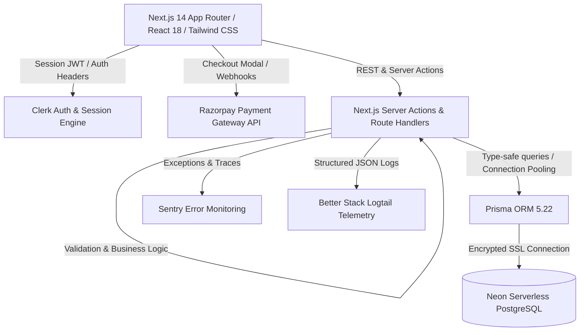
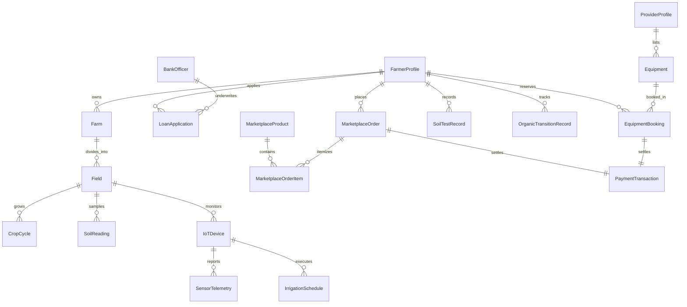
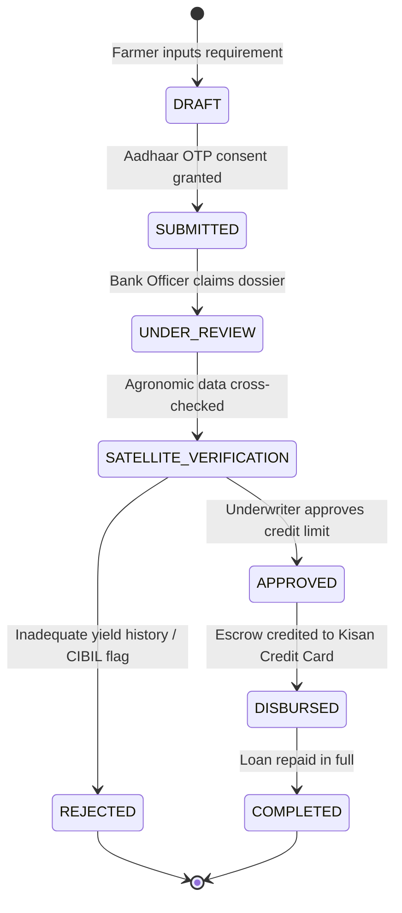
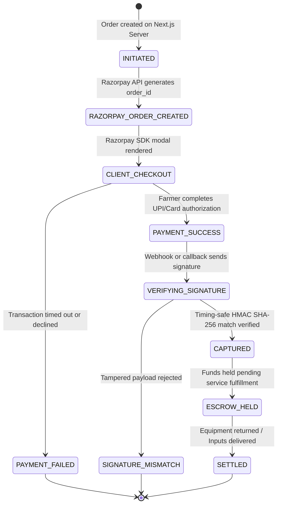

# Mazhi Sheti System Architecture & Business Logic

## 1. Executive Summary

**Mazhi Sheti** ("My Agriculture" in Marathi) is a unified digital agronomy, precision farming, and financial inclusion platform built specifically for Indian agrarian ecosystems, with specialized depth for the state of Maharashtra. It bridges the gap between grassroots smallholder farmers, financial lending institutions, agricultural equipment providers, agronomists, and regulatory authorities.

The platform eliminates fragmented point solutions by combining:
1. **Precision Agronomy**: IoT sensor ingestion, automated valve actuation, and soil organic carbon tracking.
2. **Ecological Stewardship**: Multi-year 6-stage organic transition workflows and no-till conservation practices.
3. **Agri-Fintech & Payments**: Micro-credit underwriting with statutory consent management and Razorpay-powered transactional escrow.
4. **Shared Asset Economy**: Custom hire center (CHC) equipment leasing and transparent input marketplace.

---

## 2. Technology Stack & Infrastructure

### Stack Components
- **Framework**: Next.js 14.2.24 (App Router, React 18, TypeScript, Tailwind CSS, Lucide icons).
- **Identity & Authentication**: Clerk Authentication with multi-role routing (`FARMER`, `BANK`, `PROVIDER`, `EXPERT`, `ADMIN`).
- **Database & Persistence**: Neon Serverless PostgreSQL with pg connection pooling, managed via Prisma ORM 5.22.
- **Payment Processing**: Razorpay Node SDK (Order creation, signature verification via timing-safe HMAC SHA-256, automated webhook listeners).
- **Error Tracking & Performance**: Sentry Next.js SDK (`@sentry/nextjs`).
- **Observability & Log Streaming**: Better Stack Logtail logger with sanitization filters for PII and payment credentials.

---

## 3. Relational Domain Entity Graph

The database consists of **25 relational models** defined in `prisma/schema.prisma`. The diagram below illustrates core entity relationships:

### Primary Entity Clusters
1. **Identity & Actor Directory**:
   - `FarmerProfile`: Landholding records, Aadhaar-derived hashes, KYC status, primary language (Marathi, Hindi, English).
   - `BankOfficer`: Institutional affiliations (MSCB, DCCB, SBI), branch IFSC codes, lending credit limits.
   - `ProviderProfile`: Equipment fleet operators, GSTIN, operational districts.
   - `ExpertProfile`: ICAR/KVK-certified agronomists, accreditation numbers, specialization areas.
   - `AdminUser`: Platform governance, compliance auditors, verification officers.
2. **Land & Agronomy Hierarchy**:
   - `Farm` $\rightarrow$ `Field` $\rightarrow$ `CropCycle` $\rightarrow$ `CropActivityLog`.
   - Supports multi-field partitioning with GPS polygon coordinates, soil type categorizations, and active irrigation methods.
3. **IoT & Precision Farming**:
   - `IoTDevice`: Microcontrollers (ESP32/LoRaWAN) mapped to specific fields.
   - `SensorTelemetry`: Time-series readings for soil moisture (0-100%), pH, ambient temperature, humidity, and NPK indices.
   - `IrrigationSchedule`: Automated start/end intervals, water volume targets, and manual solenoid override triggers.
4. **Soil Health & Transition**:
   - `SoilTestRecord`: Lab analysis parameters (organic carbon %, N, P, K, electrical conductivity).
   - `OrganicTransitionRecord`: 6-stage compliance tracking with audit dates, certification bodies (NPOP/SGS), and organic manure logs.
5. **Commerce & Transactions**:
   - `Equipment` & `EquipmentBooking`: Custom Hire Center (CHC) equipment rentals priced hourly/daily with security deposits.
   - `MarketplaceProduct`, `MarketplaceOrder`, `MarketplaceOrderItem`: Direct agricultural input purchases.
   - `PaymentTransaction`: Unified ledger tracking Razorpay order IDs, payment IDs, signature digests, and escrow settlements.
6. **Fintech & Governance**:
   - `LoanApplication`: KCC (Kisan Credit Card) and AIF (Agriculture Infrastructure Fund) credit applications.
   - `AuditLog`: Immutable audit trail with cryptographic Actor IDs, IP addresses, entity mutations, and statutory 7-year retention.

---

## 4. State Transition Lifecycles

### A. Loan Application Lifecycle

### B. Razorpay Transaction & Escrow Settlement

---

## 5. Security Interlocks & Compliance

1. **Actuator Safety Interlocks**: Remote irrigation solenoid valves cannot be commanded on unless local telemetry indicates water pressure is within safe operating envelopes ($>0.5\text{ bar}$) to prevent motor pump burnout.
2. **Statutory Consent Gates**: Underwriters cannot view unmasked farmer Aadhaar or bank account identifiers without an active digital consent grant generated within the preceding 30 days.
3. **Audit Trail Immutability**: The `AuditLog` table allows `INSERT` and `SELECT` operations exclusively. Updates and deletions are blocked by PostgreSQL rules and application-layer guards.
