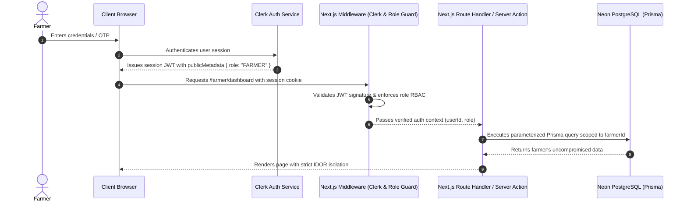

# Security, Consent & Data Sovereignty Architecture

## 1. Threat Model & Data Sovereignty Principles

Mazhi Sheti is built around the fundamental principle of **Farmer Data Sovereignty**. A farmer's land records, soil indices, harvest yields, and financial status belong exclusively to the farmer. No institutional third party (bank, equipment fleet, input dealer) can query or aggregate a farmer's telemetry without explicit, cryptographically verifiable, and revocable consent.

---

## 2. Authentication & Authorization Flow



### Key Security Safeguards
1. **Insecure Direct Object Reference (IDOR) Isolation**:
   - Every database query for farms, fields, soil tests, or equipment bookings must inject the authenticated session's `userId` as an unconditional `where` clause filter.
   - Example: `prisma.field.findMany({ where: { farm: { farmerId: session.userId } } })`.
2. **Role-Based Access Control (RBAC)**:
   - Route paths are strictly gated at the Next.js middleware level (`middleware.ts`):
     - `/farmer/*` $\rightarrow$ `FARMER` role.
     - `/bank/*` $\rightarrow$ `BANK` role.
     - `/provider/*` $\rightarrow$ `PROVIDER` role.
     - `/expert/*` $\rightarrow$ `EXPERT` role.
     - `/admin/*` $\rightarrow$ `ADMIN` role.
   - Unauthorized attempts immediately trigger redirect loops to `/auth/select` or return `403 Forbidden`.

---

## 3. Razorpay Payment Security & Webhook Idempotency

### Timing-Safe HMAC SHA-256 Signature Verification
To prevent replay and tampering attacks on payment verifications, signatures generated by Razorpay's checkout modal and webhooks are verified using cryptographic timing-safe comparisons:

```typescript
import crypto from "crypto";

export function verifyRazorpaySignature(
  orderId: string,
  paymentId: string,
  razorpaySignature: string,
  keySecret: string
): boolean {
  const generatedSignature = crypto
    .createHmac("sha256", keySecret)
    .update(`${orderId}|${paymentId}`)
    .digest("hex");

  const a = Buffer.from(generatedSignature, "utf8");
  const b = Buffer.from(razorpaySignature, "utf8");

  if (a.length !== b.length) return false;
  return crypto.timingSafeEqual(a, b);
}
```

### Webhook Idempotency
- Incoming Razorpay webhooks (`POST /api/webhooks/razorpay`) log each `x-razorpay-event-id`.
- If an event ID has already been recorded in `PaymentTransaction`, the handler immediately returns `200 OK` without re-executing business logic or creating duplicate ledger entries.

---

## 4. Privacy & Telemetry Redaction

To prevent sensitive credentials and Personal Identifiable Information (PII) from leaking into logging channels:
1. **PII Masking**:
   - Aadhaar numbers are never stored in raw plaintext; only SHA-256 salted hashes or masked strings (`XXXX-XXXX-1234`) are retained in user-facing tables.
   - Phone numbers are masked in administrative logs.
2. **Secret Sanitization Filter**:
   - The Better Stack Logtail logger and Sentry integration automatically scrub any fields labeled `password`, `keySecret`, `razorpay_signature`, `token`, or `authorization`.

---

## 5. IoT Actuator Safety Interlocks

Remote actuation commands (e.g., triggering a 3-phase pump or solenoid irrigation valve from the mobile UI) pass through safety interlock gates:
1. **Pressure Threshold Check**: Valve open commands are rejected if line pressure $< 0.5\text{ bar}$ to prevent cavitation and motor burnout.
2. **Automatic Failsafe Timer**: Solenoid actuators automatically default to `CLOSED` after a maximum continuous runtime of $120\text{ minutes}$ in the event of an internet or power disconnection.
